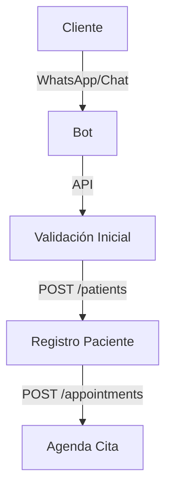

## Estructura Actual de la API
La API existente tiene los siguientes módulos principales:

```markdown
- Autenticación (JWT)
- Usuarios y Roles
- Pacientes
- Citas
- Historias Clínicas
- Procedimientos
- Inventario
```

## Propuesta de Flujo de Integración

### 1. Sistema de Captación


### 2. Integración con N8N
```markdown
#### Flujos Automatizados
1. Nuevo Paciente
   - Trigger: POST /patients
   - Acciones:
     * Crear registro en CRM
     * Enviar mensaje bienvenida
     * Programar primera cita

2. Nueva Cita
   - Trigger: POST /appointments
   - Acciones:
     * Actualizar calendario
     * Enviar confirmación
     * Programar recordatorios
```

### 3. Endpoints Principales a Utilizar

```markdown
1. Gestión de Pacientes:
   - POST /api/patients
   - GET /api/patients/{id}
   - PUT /api/patients/{id}

2. Gestión de Citas:
   - POST /api/appointments
   - GET /api/appointments/available
   - PUT /api/appointments/{id}

3. Historias Clínicas:
   - POST /api/medical-records
   - GET /api/medical-records/{patientId}
```

### 4. Flujo de Datos

```markdown
1. Registro Inicial:
   Cliente -> Bot -> API -> Base de Datos
   
2. Agendamiento:
   Bot -> Verificar Disponibilidad -> Crear Cita -> Notificar

3. Seguimiento:
   Sistema -> N8N -> WhatsApp/Email -> Cliente
```

### 5. Automatizaciones Propuestas

```markdown
1. Pre-registro:
   - Bot captura datos básicos
   - Valida información
   - Crea registro temporal
   - Agenda primera cita

2. Confirmaciones:
   - Webhook de cita creada
   - N8N procesa evento
   - Envía confirmaciones
   - Actualiza estados

3. Recordatorios:
   - Tarea programada diaria
   - Consulta citas próximas
   - Envía recordatorios
   - Registra confirmaciones
```

### 6. Seguridad y Validaciones

```markdown
1. Validaciones API:
   - JWT en headers
   - Roles y permisos
   - Sanitización de datos
   - Rate limiting

2. Validaciones Bot:
   - Verificación número
   - Captcha en web
   - Límites de intentos
   - Bloqueo por spam
```

### 7. Siguiente Paso

```markdown
1. Crear flujos en N8N:
   - Conexión con WhatsApp
   - Webhooks para API
   - Plantillas de mensajes
   - Lógica de automatización

2. Implementar Bot:
   - Integrar API WhatsApp
   - Configurar respuestas
   - Conectar con API
   - Pruebas de flujo
```
