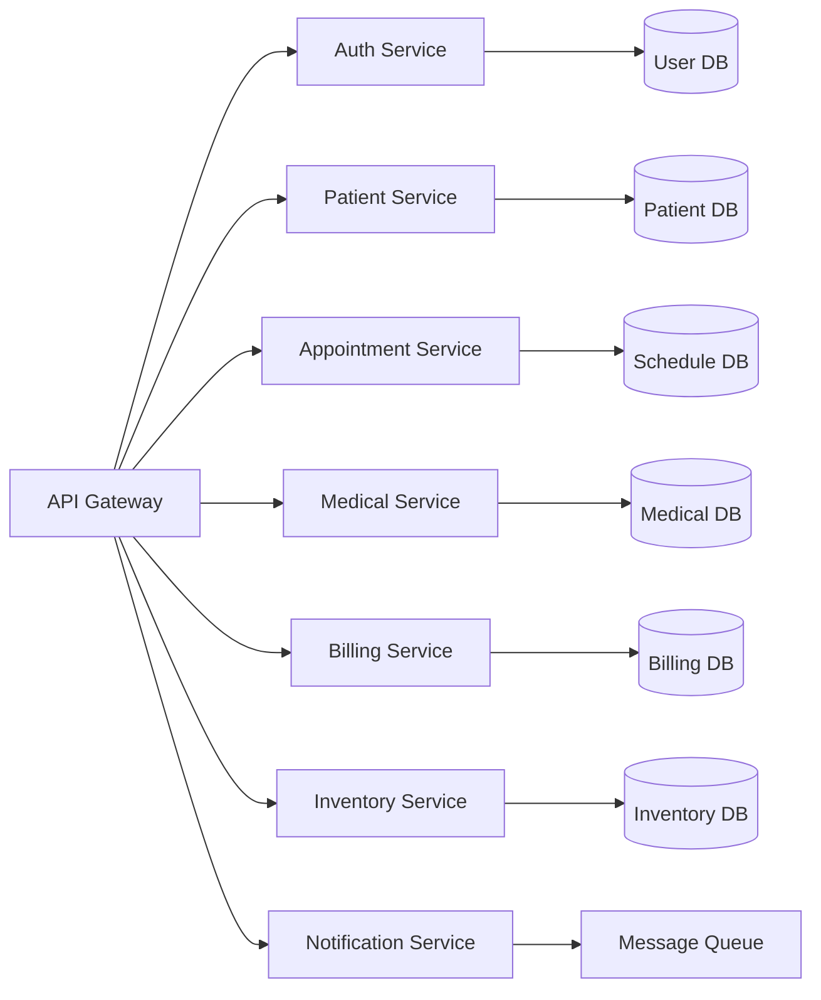

# Guía Técnica de Implementación
## Sistema de Automatización para Clínica Oftalmológica

---

## ARQUITECTURA DEL SISTEMA

### Microservicios Principales



---

## IMPLEMENTACIONES DETALLADAS

### 1. CHATBOT INTELIGENTE DE PRE-SCREENING

#### Estructura del Proyecto:
```
chatbot_service/
├── app/
│   ├── main.py
│   ├── models/
│   │   ├── nlp_model.py
│   │   └── screening_model.py
│   ├── services/
│   │   ├── conversation_service.py
│   │   └── classification_service.py
│   └── utils/
│       └── medical_keywords.py
├── training/
│   ├── train_model.py
│   └── data/
│       └── medical_conversations.json
└── requirements.txt
```

#### Código Base del Chatbot:

```python
# app/main.py
from fastapi import FastAPI, WebSocket
from app.services.conversation_service import ConversationService
from app.models.screening_model import ScreeningModel
import json

app = FastAPI(title="Ophthalmology Screening Chatbot")
conversation_service = ConversationService()
screening_model = ScreeningModel()

@app.websocket("/chat")
async def websocket_endpoint(websocket: WebSocket):
    await websocket.accept()
    session_id = generate_session_id()
    
    try:
        while True:
            # Recibir mensaje del usuario
            data = await websocket.receive_text()
            message_data = json.loads(data)
            
            # Procesar mensaje
            response = await conversation_service.process_message(
                message=message_data['message'],
                session_id=session_id,
                user_data=message_data.get('user_data', {})
            )
            
            # Enviar respuesta
            await websocket.send_text(json.dumps(response))
            
    except Exception as e:
        await websocket.close(code=1000)

# app/services/conversation_service.py
import openai
from typing import Dict, List
from app.models.screening_model import ScreeningModel

class ConversationService:
    def __init__(self):
        self.screening_model = ScreeningModel()
        self.conversation_history = {}
        
    async def process_message(self, message: str, session_id: str, user_data: Dict) -> Dict:
        # Inicializar historial si es nuevo
        if session_id not in self.conversation_history:
            self.conversation_history[session_id] = {
                'messages': [],
                'user_data': user_data,
                'screening_data': {},
                'urgency_level': 0
            }
        
        # Agregar mensaje del usuario al historial
        self.conversation_history[session_id]['messages'].append({
            'role': 'user',
            'content': message,
            'timestamp': datetime.now()
        })
        
        # Generar respuesta inteligente
        response = await self._generate_response(message, session_id)
        
        # Evaluar urgencia médica
        urgency = self.screening_model.evaluate_urgency(message)
        self.conversation_history[session_id]['urgency_level'] = max(
            self.conversation_history[session_id]['urgency_level'], 
            urgency
        )
        
        # Determinar siguiente acción
        next_action = self._determine_next_action(session_id)
        
        return {
            'response': response,
            'urgency_level': urgency,
            'next_action': next_action,
            'session_id': session_id
        }
    
    async def _generate_response(self, message: str, session_id: str) -> str:
        context = self._build_context(session_id)
        
        prompt = f"""
        Eres un asistente médico especializado en oftalmología. Tu tarea es hacer preguntas para evaluar la urgencia de la consulta del paciente.
        
        Contexto de la conversación: {context}
        Último mensaje del paciente: {message}
        
        Responde de manera empática y profesional. Haz UNA pregunta específica para obtener información médica relevante.
        
        Síntomas a evaluar prioritariamente:
        - Pérdida súbita de visión
        - Dolor ocular severo
        - Flashes de luz o moscas volantes
        - Visión doble
        - Lesiones oculares
        """
        
        # Aquí integrarías con OpenAI GPT o modelo local
        response = await self._call_language_model(prompt)
        return response
    
    def _determine_next_action(self, session_id: str) -> str:
        urgency = self.conversation_history[session_id]['urgency_level']
        message_count = len(self.conversation_history[session_id]['messages'])
        
        if urgency >= 8:  # Urgencia crítica
            return "emergency_referral"
        elif urgency >= 6:  # Urgencia alta
            return "priority_appointment"
        elif message_count >= 10:  # Suficiente información recopilada
            return "schedule_appointment"
        else:
            return "continue_screening"

# app/models/screening_model.py
import re
from typing import Dict, List
import joblib

class ScreeningModel:
    def __init__(self):
        self.emergency_keywords = [
            'pérdida súbita', 'perdida subita', 'ceguera', 'no veo nada',
            'dolor intenso', 'dolor severo', 'sangre en ojo',
            'accidente ocular', 'golpe en ojo', 'químico en ojo'
        ]
        
        self.high_priority_keywords = [
            'visión borrosa', 'moscas volantes', 'destellos',
            'dolor de cabeza', 'mareos', 'visión doble'
        ]
        
        # Cargar modelo entrenado si existe
        try:
            self.ml_model = joblib.load('models/urgency_classifier.pkl')
        except:
            self.ml_model = None
    
    def evaluate_urgency(self, message: str) -> int:
        message_lower = message.lower()
        urgency_score = 0
        
        # Evaluar palabras clave de emergencia (8-10)
        for keyword in self.emergency_keywords:
            if keyword in message_lower:
                urgency_score = max(urgency_score, 9)
        
        # Evaluar palabras clave de alta prioridad (5-7)
        for keyword in self.high_priority_keywords:
            if keyword in message_lower:
                urgency_score = max(urgency_score, 6)
        
        # Si hay modelo ML entrenado, usar predicción
        if self.ml_model:
            ml_score = self.ml_model.predict_proba([message])[0]
            ml_urgency = int(ml_score * 10)
            urgency_score = max(urgency_score, ml_urgency)
        
        return min(urgency_score, 10)  # Máximo 10
```

### 2. SISTEMA DE GESTIÓN DE CITAS INTELIGENTE

#### Algoritmo de Optimización de Citas:

```python
# services/appointment_optimizer.py
from datetime import datetime, timedelta
from typing import List, Dict, Optional
from dataclasses import dataclass
import heapq

@dataclass
class Doctor:
    id: int
    name: str
    specialties: List[str]
    working_hours: Dict[str, Dict]  # {'monday': {'start': '08:00', 'end': '17:00'}}
    current_load: float  # Porcentaje de ocupación actual

@dataclass
class AppointmentSlot:
    doctor_id: int
    datetime: datetime
    duration: int  # minutos
    appointment_type: str
    priority_score: float

class IntelligentScheduler:
    def __init__(self):
        self.doctors = self._load_doctors()
        self.existing_appointments = self._load_existing_appointments()
    
    def find_optimal_appointment(self, 
                                patient_id: int,
                                appointment_type: str,
                                urgency_level: int,
                                preferred_dates: List[datetime] = None) -> Optional[AppointmentSlot]:
        
        # Obtener médicos disponibles para el tipo de cita
        available_doctors = self._get_doctors_by_specialty(appointment_type)
        
        # Generar slots disponibles
        available_slots = []
        for doctor in available_doctors:
            slots = self._generate_available_slots(doctor, appointment_type)
            available_slots.extend(slots)
        
        # Aplicar algoritmo de scoring
        scored_slots = []
        for slot in available_slots:
            score = self._calculate_slot_score(slot, urgency_level, preferred_dates)
            heapq.heappush(scored_slots, (-score, slot))  # Negative for max heap
        
        # Retornar el mejor slot
        if scored_slots:
            _, best_slot = heapq.heappop(scored_slots)
            return best_slot
        
        return None
    
    def _calculate_slot_score(self, slot: AppointmentSlot, urgency: int, preferred_dates: List[datetime]) -> float:
        score = 0.0