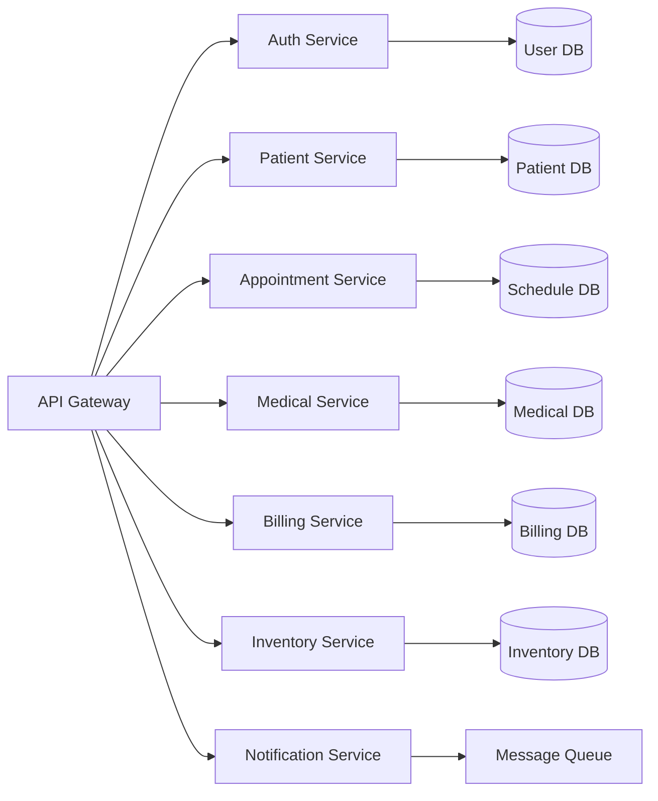

# Guía Técnica de Implementación
## Sistema de Automatización para Clínica Oftalmológica

---

## ARQUITECTURA DEL SISTEMA

### Microservicios Principales



---

## IMPLEMENTACIONES DETALLADAS

### 1. CHATBOT INTELIGENTE DE PRE-SCREENING

#### Estructura del Proyecto:
```
chatbot_service/
├── app/
│   ├── main.py
│   ├── models/
│   │   ├── nlp_model.py
│   │   └── screening_model.py
│   ├── services/
│   │   ├── conversation_service.py
│   │   └── classification_service.py
│   └── utils/
│       └── medical_keywords.py
├── training/
│   ├── train_model.py
│   └── data/
│       └── medical_conversations.json
└── requirements.txt
```

